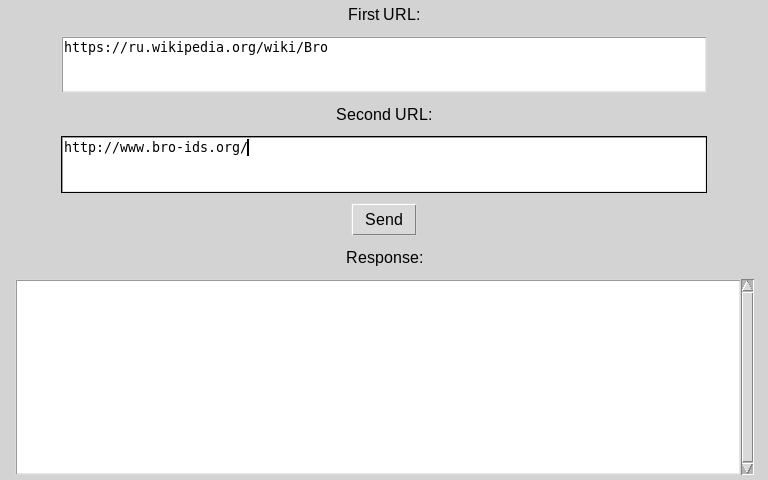
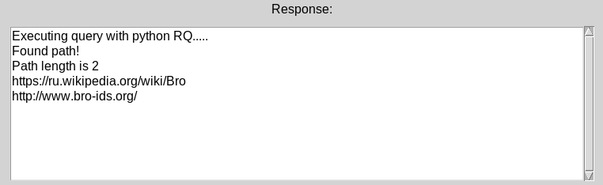

# Message Queue

В этом репозитории находится серверная и клиентская часть для приложения, которое ищет расстояние между этими страницами (например, между страницами Википедии).

Для реализации используется RPC и очередь сообщений на основе Redis.

#### Скриншоты

#### Используемые материалы

https://python-rq.org/

https://habr.com/ru/company/piter/blog/458344/